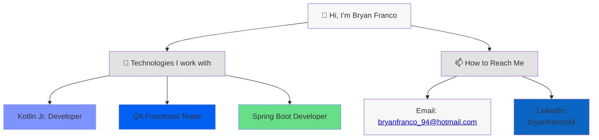

  <h1 align="center"> Hey this is Bryan 👋 { Welcome to my GitHub } 💻</h1>

- 👋 Hi, I’m @BFranco-94
- 👨‍💼 Currently with a little more of 4 YOE as QA Functional Tester, with experience as Java Jr & DevOps Engineer
- 👀 I’m interested in learn more about Java, Spring boot, React Js, Kotlin
- 🌱 I’m currently learning Spring boot, JUnit, Linux CLI scripting and Kotlin for Android development
- 💞️ I’m looking to collaborate on a begginer project about Spirng boot or Kotling/Android technologie to learn more and get more experience
- 📫 How to reach me, send me a mail to <a href="mailto:bryanfranco_94@hotmail.com">bryanfranco_94@hotmail.com</a>  or reach out to me from Linkedin [{ bryanfranco94 }](https://www.linkedin.com/in/bryanfranco94/)

<!---
BFranco-94/BFranco-94 is a ✨ special ✨ repository because its `README.md` (this file) appears on your GitHub profile.
You can click the Preview link to take a look at your changes.
--->
